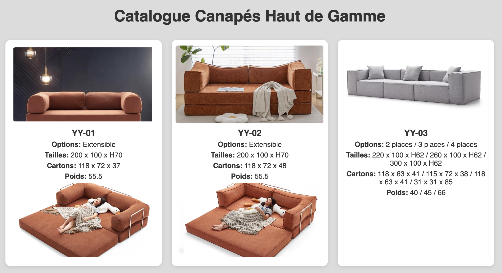

# bookCanape.github.io
# 🛋️ Catalogue Canapés Haut de Gamme

Ce projet est une page web en **HTML/CSS/JavaScript** qui présente un catalogue de canapés haut de gamme avec images, options et dimensions.  
Il s’agit d’un tableau élégant, responsive et interactif grâce à un effet de survol (*hover*) et un système de **modal** permettant d’agrandir les images.

---

## ✨ Fonctionnalités

- 📋 Présentation des canapés sous forme de **tableau clair et structuré**  
- 🖼️ **Affichage des images** des modèles directement dans le tableau  
- 🔍 **Zoom en plein écran** sur les images au clic (modal interactif)  
- 🎨 Design moderne avec **fond gris** et tableau sur fond blanc  
- 🖱️ **Effet hover** pour rendre l’expérience plus dynamique  
- 📐 Détails complets : référence, tailles, dimensions carton, poids, options  

---

## 📂 Structure du projet

```
.
├── index.html     # Page principale avec le catalogue
├── style.css      # Feuille de style (optionnel si séparée)
├── script.js      # JavaScript pour le modal (optionnel si séparé)
├── images/        # Dossier contenant les photos des canapés
└── README.md      # Ce fichier
```

---

## 🚀 Utilisation

1. **Cloner le dépôt :**
   ```bash
   git clone https://github.com/ton-utilisateur/catalogue-canapes.git
   cd catalogue-canapes
   ```

2. **Ouvrir le projet :**  
   Ouvre simplement `index.html` dans ton navigateur.
   Disponible également en ligne sur https://blmentreprise.github.io/bookCanape.github.io/

---

## 📸 Aperçu



---

## 🔧 Améliorations possibles

- Ajouter un vrai système de **filtrage/recherche** dans le tableau  
- Rendre le tableau **100% responsive** pour mobile  
- Lier les données via un fichier **JSON** pour faciliter la mise à jour  

---

## 👤 Auteur

Projet réalisé par **Farida**, 2025.  
Catalogue réalisé pour BLM Entreprise.
